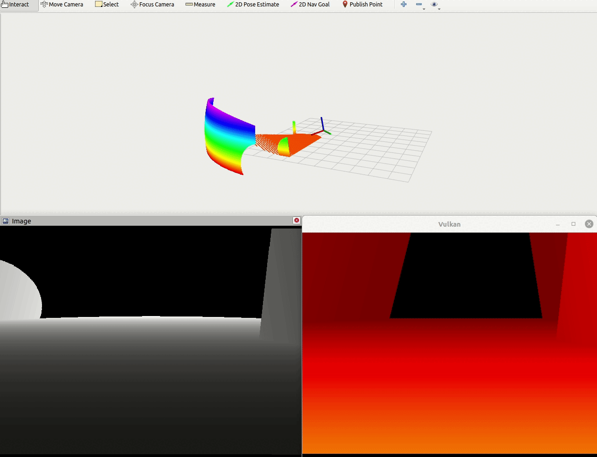

# Depth Camera Simulation

This package is part of FLYBO simulation framework.



# Installation
Installation instructions are provided in the [FLYBO wiki](https://github.com/anthonybrunel/FLYBO/wiki). Feel free to create an issues if you have any questions or problems related to this package.


# Example

```roslaunch vulkan_depth_vision vizualisation_demo.launch```

**Control in Vulkan Window**

Keys  | Action
----- | ------
Z  | forward
Q  | left
S  | back
D  | right


